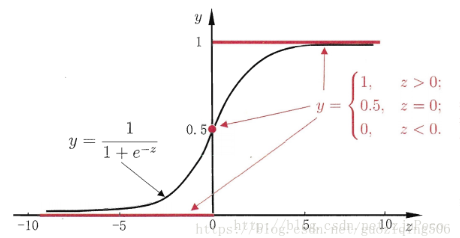

# 逻辑斯特回归 (logistic regression)

- [ ] 首先介绍一下线性回归：

  线性回归的一般公式如下：
  $$
  z = f(X) = w_{0}+w_{1}x_{1}+w_{2}x_{2}+...++w_{m}x_{m} = θ^{T}x
  $$
  给定X，输出值z是连续值，线性回归的目的是根据数据，拟合一条直线，然后根据这条直线对未知数据进行预测。

  假设现在我们想解决的是一个二分类问题，只有{0，1}二值，那么我们该怎么做呢？

- [ ] 首先想到的是使用阶跃函数：

  ​       
  $$
  \begin{equation}
  ϕ(z)=
  \left\{\begin{matrix}
  0, z<0 \\ 
  0.5, z=0 \\
  1, z>0
  \end{matrix}\right.
  \end{equation}
  $$
  但是直接使用阶跃函数，不利于之后的优化计算，因为函数值不连续，无法进行求导。

- [ ] 随后就找到了替代函数 sigmoid函数，它近似单位阶跃函数，同时是单调可微的，它将输出值z归一化到(0, 1)区间。

  

因此，我们可以得到预测值为：
$$
Z = θ^{T}x,  \\
h_{θ(x)} = g(θ^{T}x) = \frac{1}{1 + e^{-θ^{T}x}}, \\
其中, \\
g(x) = \frac{1}{1 + e^{-x}}
$$

### 逻辑回归的概率公式

1. 因为二分类满足伯努利分布，即，

   假设对于一个给定的样本x，输出y = 1的概率是：
   $$
   p(y=1|x;θ) = h_{θ(x)}
   $$
   那么，y = 0的概率即为：
   $$
   p(y=0|x;θ) = 1 - h_{θ(x)}
   $$
   因此，
   $$
   p(y|x;θ) = (h_{θ(x)})^{y}(1 - h_{θ(x)})^{1-y}
   $$

 ### 梯度上升更新参数

根据上述，概率越大越好，所以使用最大似然估计。

似然函数：
$$
\begin{eqnarray}
L(θ)&=&p(y|X;θ) \\
    &=&\prod_{i=1}^{m}p(y^{i}|x^{i};θ) \\
    &=&\prod_{i=1}^{m}(h_{θ(x^{i})})^{y}(1 - h_{θ(x^{i})})^{1-y}
\end{eqnarray}
$$
对似然函数取log：
$$
\begin{eqnarray}
l(θ)&=&logL(θ) \\
    &=&\sum_{i=1}^{m}y^{i}log(h_{θ(x^{i})})(1-y^{i})log(1 - h_{θ(x^{i})})
\end{eqnarray}
$$
对θ求导，这里以一个样本为例：
$$
\begin{eqnarray}
\frac{∂l(θ)}{∂θ_{j}}&=&(y\frac{1}{g(θ^{T}x)}-(1-y)\frac{1}{1-g(θ^{T}x)})\frac{∂g(θ^{T}x)}{∂θ_{j}} \\
&=&(y\frac{1}{g(θ^{T}x)}-(1-y)\frac{1}{1-g(θ^{T}x)})
g(θ^{T}x)(1-g(θ^{T}x))\frac{∂θ^{T}x}{∂θ_{j}} \\
&=&(y(1-g(θ^{T}x))) - (1-y)g(θ^{T}x))x_{j} \\
&=&(y-g(θ^{T}x))x_{j} \\
&=&(y-h_{θ(x)})x_{j}
\end{eqnarray}
$$
注：sigmoid函数的导数为：
$$
g(z)^{'} = g(z)(1-g(z))
$$
由于是最大似然函数，所以使用梯度上升迭代：

所以对θ进行更新：
$$
θ_{j} := θ_{j} + \alpha(y^{i}-h_{θ(x^{i})})x_{j}
$$

